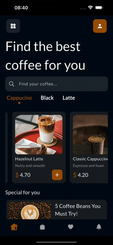
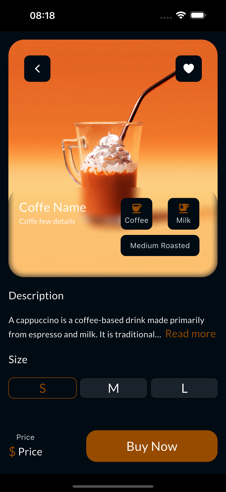

# ☕ Coffee Shop

Coffee Shop is a Flutter UI project created for practice and self-improvement.  
The design was inspired by a coffee shop interface found on Dribbble, and the goal was to faithfully reproduce the user interface to enhance my Flutter development skills.  
🔗 Design inspiration: [Dribbble coffe shop UI](https://dribbble.com/shots/15475209-Coffee-Shop-Mobile-Apps-Dark-Mode)  
📸 Coffee images used in the app were sourced from [Unsplash](https://unsplash.com).

---


## 🎥 Preview



---

## 📸 Screenshots

| Home Screen | Product Details                              |
|-------------|------------------|
|  |  |


## 🚀 Features

- 🛍 Browse coffee and snack items
- 🧾 View detailed product information
- 🧭 Smooth page navigation

---

## 📦 Getting Started

### Prerequisites

Ensure you have the following installed:

- Flutter SDK: https://docs.flutter.dev/get-started/install
- Dart (included with Flutter)
- Android Studio or Visual Studio Code
- A connected device or emulator

### Setup

1. Clone the repository:
   git clone https://github.com/Kenneth-Anthony-G/coffee-shop.git
   cd coffee_shop

2. Install dependencies:
   flutter pub get

3. Launch the application:
   flutter run

---

## 🗂 Project Structure
```
lib/
├── main.dart           # Application entry point
├── screens/            # Different pages/screens
├── widgets/            # Reusable UI components
├── models/             # Data models
└── services/           # Logic and external services
```

---

## 🛠 Contributing

Contributions are welcome!  
Feel free to submit pull requests or open issues to propose improvements.

---
## 📬 Contact

For questions or collaboration opportunities, please reach out at:  
anthonyedem46@gmail.com

---

Happy brewing and building! ☕🚀
